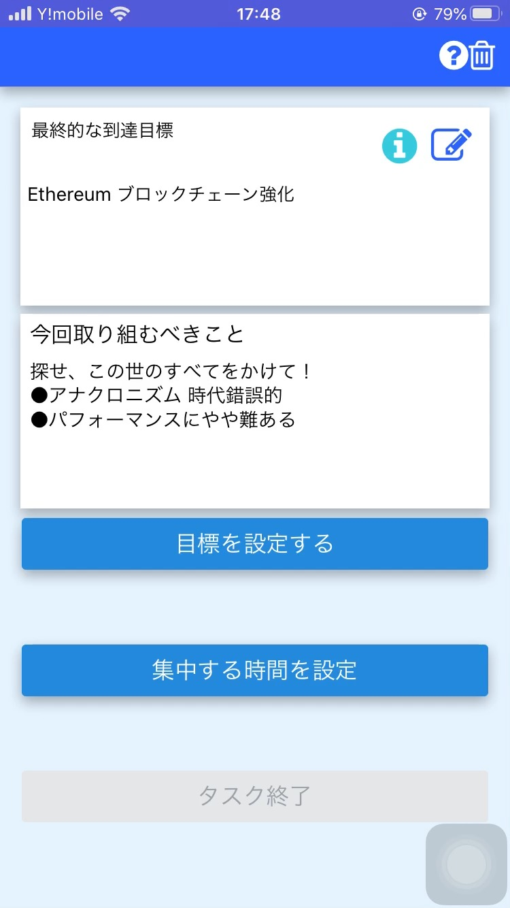

# React Native タスク管理マネージャー

## 環境
EXPO  sdkVersion: "36.0.0"

## 概要  
　長期的な学習目標，達成したい目標を定め，そこからユーザーが為すべき短期的なタスクや目標，ノルマを明らかにすることを補助する．またその継続的な管理を手助けするアプリ 

　　

## このアプリの仕様の流れ  
 1. 長期的な目標を定める  
 2. 中期的，中間的に為すべき優先事項を明確にする  
 3. 現在の到達度などを理解，知る  (Observe)  
 4. 3．で確認したなどから，問題点，その原因を分析する (Orient）  
 5. 4．で今やるべき優先すべきタスクを定める  (Decide） 
 6. 5.で定めた今やるべきことを実行する （Act）  
 7. 6．の反省を行う  
 8. 7．の反省を生かして，3．に戻り，再度，中期目標を修正し，今やるべきことを決定する  
 9. 3．から9．までのこのプロセスの繰り返す  
  

## PDCA　vs OODA  
  このアプリは，OODAを主軸にし，PDCAサイクルの要素を取り入れた．

**OODA Loop**  
 - 観察（Observe）  
 - 情勢への適応（Orient）  
 - 意思決定（Decide）  
 - 行動（Act） 
 
参考  
[富士通　Knowledge Integration in Action デジタルビジネス時代への羅針盤](https://www.google.com/url?sa=t&rct=j&q=&esrc=s&source=web&cd=9&cad=rja&uact=8&ved=2ahUKEwiOv_6HrpDpAhXMA4gKHVW2BM0QFjAIegQIChAB&url=https%3A%2F%2Fwww.fujitsu.com%2Fjp%2Fdocuments%2Fservices%2Fknowledge-integration%2Fknowledge_integration_mook.pdf&usg=AOvVaw0nWP_fIoP--J8_st457P1l)

